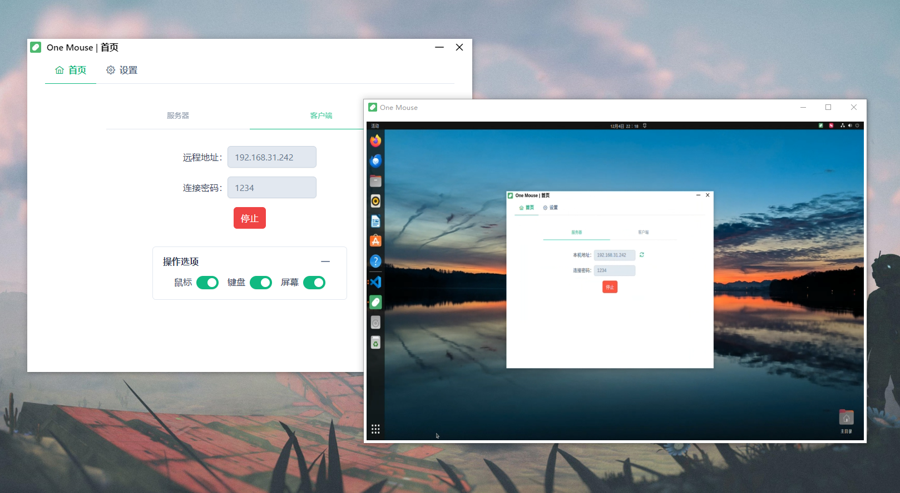

<div align="center">
    
    <h1>One Mouse</h1>
    <p>🐹基于electron和webRTC的内网远程控制工具。</p>
    <a href="https://www.electronjs.org" style="text-decoration:none;margin:0.5em">electron✅</a>
    <a href="https://cn.vuejs.org" style="text-decoration:none;margin:0.5em">vue✅</a>
    <a href="https://developer.mozilla.org/en-US/docs/Web/API/WebRTC_API" style="text-decoration:none;margin:0.5em">WebRTC✅</a>
    <a href="https://github.com/nut-tree/nut.js" style="text-decoration:none;margin:0.5em">nut.js✅</a>
</div>
<hr>
<br>

## 🍍Introduction
一个内网远程控制工具，对鼠标、键盘和屏幕可以分别选择是否控制。

详细介绍：https://juejin.cn/post/7382897150047109158
## 🍓Software Interface
<div align="center">
    
</div>

## 🍉Installation

1. 下载源代码：
```bash
git clone https://github.com/Scanood/onemouse.git
```
2. 安装依赖：
```bash
cd onemouse
npm i
```
3. 启动：
```bash
npm run start
```
更多设置请查阅：[Electron Forge](https://www.electronforge.io/)

## 🍞License
[MIT License](./LICENSE)


